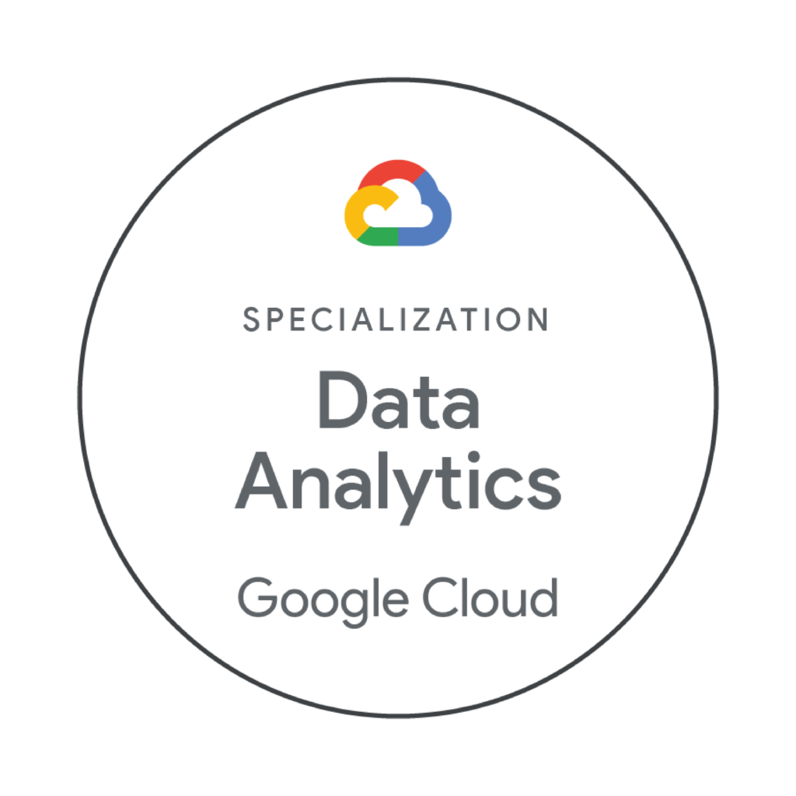

<a href="https://www.cloudskillsboost.google/paths/420/">

<h1 align="center"><a href="https://www.cloudskillsboost.google/paths/420/">Google Cloud Data Analytics</a></h1>

  Este proyecto fue hecho por
    <a href="https://github.com/DensLopez">Dennis.</a>
  

 
 
Este repositorio está relacionado a <a href="https://www.cloudskillsboost.google/paths/420/">"Google Cloud Data Analytics Certificate"</a> tomado en <a href="https://www.cloudskillsboost.google/">Google Cloud Skills Boost.</a> Además, contiene archivos con el material desarrollado en el curso.
 

<h1 align="center">Acerca de </h1>

¡Conviértete en una potencia impulsada por los datos con Google Cloud!

Como Analista de Datos en la Nube, descubrirás información valiosa oculta en enormes conjuntos de datos, transformando cifras en bruto en historias impactantes que moldean estrategias empresariales en todo el mundo. Este programa de certificación es tu plataforma de lanzamiento: una combinación cuidadosamente diseñada de instrucción experta y desafíos del mundo real. 

Construirás un portafolio con proyectos impresionantes, demostrando a los empleadores que sabes analizar, visualizar y comunicar datos. Aquí es donde comienza tu viaje: prepárate para dominar las herramientas y estrategias que convierten los datos en acciones decisivas.

 
 

## Actividades

### Introduction to Data Analytics in Google Cloud

- Diseña un plan de ciclo de vida de datos
  
  

   
